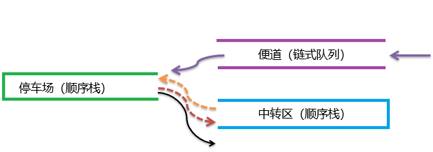
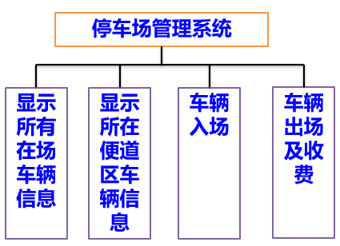
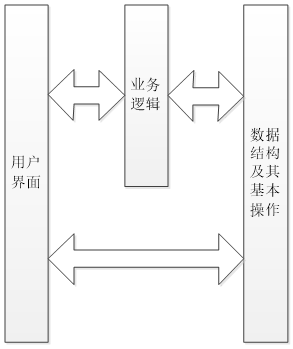

# 停车场管理系统  

### 问题分析  

**简介**  
> 设停车场是一个可停放n辆车的狭长通道，且只有一个大门可供汽车进出。
在停车场内，汽车按到达的先后次序，由北向南依次排列（假设大门在最南端）。
若停车场内已停满n辆车，则后来的汽车需在门外的便道上等候，当有车开走时，
便道上的第一辆车即可开入。当停车场内某辆车要离开时，
在它之后进入的车辆必须先退出停车场为它让路，待该辆车开出大门后，
其他车辆再按原次序返回车场。每辆车离开停车场时，应按其停留时间的长短交费
（在便道上停留的时间不收费）。  

**停车场**  
   - 停车场是一个可停放n辆车的狭长通道（线性结构）  
   - 且只有一个大门可供汽车进出（受限的线性结构——栈）
   - 当停车场内某辆车要离开时，在它之后进入的车辆必须先退出停车场为它让道，
      待该辆车开出大门后，其他车辆再按原次序返回车场（另一个栈，大小？）

**便道**  
   - 便道是一个狭长通道，且等待车辆数不确定（线性结构）  
   - 便道中的车辆以排队方式先进先出（队列）  
   - 当有车到达时，若停车场已满或便道上有等待车辆，则进入便道排队等待（入队）  
   - 当停车场有车出场时，便道中排在最前的车辆先进入停车场（出队，并进栈）  

**收费**  
   - 车辆离开按在停车场停留时间的长短交费 
   - 在便道上停留的时间不收费  

### 数据结构定义  

**顺序栈**  
- 初始化  
- 进栈  
- 出栈  
- 取栈顶元素  
- 判空  
- 判满  

**队列**  
- 初始化  
- 入队  
- 出队  
- 判空  

### 业务需求 

- 车辆进场
- 车辆出场和收费
- 查找车辆是否在场
- 显示所有入场车辆信息
- 显示所有便道等待车辆信息

**车辆进场业务逻辑**  
> 登记车辆信息；如果停车场满，则进入便道等待，否则直接进入停车场，并记录入场时间。  

**车辆出场和收费业务逻辑**  
> 输入出场车辆标识（如车牌号），若车辆不在场，结束；否则，出场车辆前面的依次出场进入临停区，车辆出场并根据出场时间计算费用，临停区车辆按原次序进入停车场。
### 系统结构  
   
  